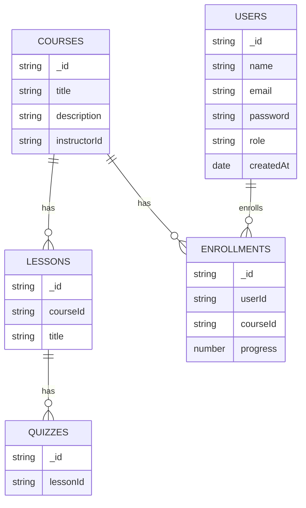

# SmartLearn — Architecture & Phase 0 Documentation

> **Project:** SmartLearn — AI‑Powered Learning Management System (LMS)
>
> **Purpose:** Reference document for project architecture, MVP scope, data model, API design, deployment, CI/CD, security, and development roadmap (Phase‑0 deliverables).

---

## 1. Project Overview

SmartLearn is a full‑stack LMS that enables instructors to publish courses and lessons, and students to enroll, study and take quizzes. An AI Tutor provides lesson summarization and quiz generation. The MVP focuses on the core learning flow so the product is demonstrable and deployable.

**MVP Goals:**

- User Authentication (JWT) + roles (Instructor, Student)
- Course & Lesson CRUD (Instructor)
- Student enrollment & progress tracking
- Lesson‑level quiz with auto grading (MCQ)
- AI summary feature (OpenAI API)
- Responsive frontend (React + TypeScript)
- Backend API (Node + Express + TypeScript)
- Database (MongoDB Atlas)
- Deployed demo (Vercel frontend, Render backend)

---

## 2. High Level Architecture

```
Users (Browser / Mobile)  <--->  Frontend (React + TS)  <--->  Backend API (Express + TS)  <--->  MongoDB Atlas
                                                            |
                                                            +--> OpenAI API (summaries / quiz generation)
                                                            +--> Optional: Stripe (payments)
                                                            +--> Optional: Vector DB (Pinecone / Milvus) for RAG
```

**Communication:** HTTPS REST for most operations. WebSockets (Socket.io) optionally for realtime features (chat, live updates).

---

## 3. Folder Structure (Monorepo Recommended)

```
smartlearn/
├─ apps/
│  ├─ web/            # Next.js or Vite + React + TypeScript frontend
│  └─ api/            # Express + TypeScript backend
├─ packages/
│  └─ shared/         # shared types/interfaces between web & api
├─ docs/
│  ├─ architecture.md
│  ├─ erd.md
│  └─ api-design.md
├─ infra/
│  └─ docker/         # Dockerfiles and compose for local dev
├─ .github/workflows/ # CI configs
└─ README.md
```

**Notes:** Keep frontend and backend independent deploy targets. Use `packages/shared` for DTOs/types to avoid duplication.

---

## 4. Data Model (MongoDB Collections)

### users

```json
{
  _id: ObjectId,
  name: string,
  email: string,
  passwordHash: string,
  role: 'student' | 'instructor' | 'admin',
  avatar?: string,
  coins?: number,
  createdAt: Date
}
```

### courses

```json
{
  _id: ObjectId,
  title: string,
  description?: string,
  instructorId: ObjectId,
  price?: number,
  published: boolean,
  createdAt: Date
}
```

### lessons

```json
{
  _id: ObjectId,
  courseId: ObjectId,
  title: string,
  content: string, // markdown or html
  contentType: 'text' | 'video',
  resources?: [ { type, url } ],
  order?: number,
  createdAt: Date
}
```

### enrollments

```json
{
  _id: ObjectId,
  userId: ObjectId,
  courseId: ObjectId,
  progress: number, // 0-100
  startedAt: Date,
  completedAt?: Date
}
```

### quizzes

```json
{
  _id: ObjectId,
  lessonId: ObjectId,
  questions: [
    { question: string, options: [string], correctIndex: number }
  ]
}
```

### ai_embeddings (optional for later RAG)

```json
{
  _id: ObjectId,
  lessonId: ObjectId,
  vector: Binary,
  metadata: { textSliceId, createdAt }
}
```

---

## 5. ERD & Diagram

Add `docs/erd.md` with a Mermaid diagram (or include image `docs/erd.png`). Example Mermaid snippet for GitHub rendering:



---

## 6. API Design (MVP Endpoints)

### Auth

- `POST /v1/auth/register` — register user
- `POST /v1/auth/login` — login (returns access + refresh tokens)
- `GET /v1/auth/me` — get current user

### Courses

- `GET /v1/courses` — list courses (filters)
- `GET /v1/courses/:id` — course details
- `POST /v1/courses` — create (instructor)
- `PUT /v1/courses/:id` — update (instructor)
- `DELETE /v1/courses/:id` — delete (instructor)

### Lessons

- `POST /v1/courses/:courseId/lessons` — create lesson
- `GET /v1/courses/:courseId/lessons` — list
- `GET /v1/lessons/:id` — lesson content

### Enrollment

- `POST /v1/courses/:id/enroll` — student enrolls
- `GET /v1/users/:id/enrollments` — user courses

### Quiz

- `GET /v1/lessons/:id/quiz` — fetch quiz
- `POST /v1/lessons/:id/quiz/submit` — submit answers, get score

### AI

- `POST /v1/ai/summary` — { lessonId } -> returns short summary (backend calls OpenAI)
- `POST /v1/ai/generate-quiz` — { lessonId } -> generate MCQs (optional for instructor)

---

## 7. Authentication & Security

- Authentication: JWT access tokens (short lived) + refresh tokens (httpOnly cookie)
- Passwords: bcrypt hashing (salt rounds >= 10)
- Input Validation: use JOI / Zod for request DTO validation
- Rate limiting: protect AI endpoints (avoid cost spikes)
- CORS: restrict to known origins
- Vulnerability controls: sanitize inputs, use helmet, enforce HTTPS in production

---

## 8. Dev Tools, Linting & CI

- ESLint + Prettier + Husky (pre-commit hooks)
- TypeScript `strict` mode
- Unit tests: Jest for backend + React Testing Library for frontend
- E2E tests (optional): Cypress
- CI: GitHub Actions pipeline: lint -> test -> build -> deploy
- Secrets: GitHub Secrets for API keys (OpenAI, DB, Stripe)

---

## 9. Deployment Plan

- **Frontend:** Vercel (automatic on push to `main`) — environment vars set in Vercel
- **Backend:** Render / Railway / Heroku or a small EC2/ECS service — deploy Docker image or Node process
- **Database:** MongoDB Atlas (free tier for dev)
- **Vector DB (optional):** Pinecone / Milvus / Weaviate (managed)

**CI/CD Flow:**

- push -> run CI -> on main branch pass -> auto deploy frontend to Vercel and backend to Render

---

## 10. AI Integration (MVP approach)

**Phase 1 (MVP AI):**

- Simple summarization using OpenAI `text-embedding` or `gpt-4`/`gpt-3.5-turbo` prompts.
- Backend endpoint `/v1/ai/summary` reads lesson content, constructs prompt, sends to OpenAI, returns summary.
- Add basic rate limiting and caching for repeated requests.

**Phase 2 (RAG):**

- Chunk lesson content and create embeddings, store in vector DB.
- For question answering, retrieve top-k chunks, build prompt with context, then call LLM.

**Cost control:** track calls, limit per-user usage, add paid plan for heavy usage.

---

## 11. Non-functional Requirements & Scaling

- **Performance:** paginate lists, index DB fields (courseId, userId), cache frequent reads
- **Availability:** stateless API nodes behind load balancer for scale
- **Observability:** logs (structured), error tracking (Sentry)
- **Backups:** snapshot MongoDB regularly

---

## 12. Development Roadmap (Phase 0 → Phase 1)

**Phase 0 (this doc + repo skeleton)** — 3–5 days
**Phase 1 (Auth + Core models + Course CRUD)** — 2 weeks
**Phase 2 (Lessons + Enrollments + Quizzes)** — 2 weeks
**Phase 3 (AI summarizer + basic RAG experiment)** — 2 weeks
**Phase 4 (Deploy + Tests + Docs)** — 1–2 weeks

Total MVP estimate (part‑time): 8–12 weeks

---

## 13. Checklist (Phase 0 Completion)

- [ ] Repo created & monorepo skeleton
- [ ] `apps/api` stub (TS + Express) committed
- [ ] `apps/web` stub (React + TS) committed
- [ ] `packages/shared` created for types
- [ ] `docs/architecture.md` (this file) added
- [ ] `docs/erd.md` with Mermaid diagram added
- [ ] ESLint + Prettier configuration added
- [ ] CI workflow skeleton added

---

## 14. Next Steps (Day 3)

Start building the **backend skeleton**:

- Initialize `apps/api` with TypeScript config
- Add basic Express server and `/v1/health` route
- Setup environment variables and `.env.example`
- Create `users` model (Mongoose) and connect to MongoDB Atlas

---

If you want, I can now:

1. Generate the exact file contents for `docs/erd.md`, `docs/api-design.md`, and `README.md` ready to paste into your repo; **or**
2. Create the `apps/api` starter files (TypeScript Express server + sample `.env.example`) and provide terminal commands to run them.

Choose which one you want me to produce next.
